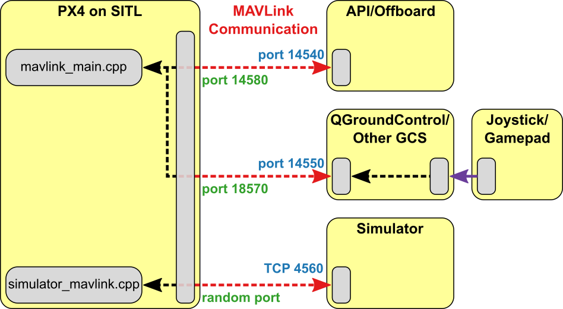

# WSL - PX4, ROS/MAVROS, GAZEBO

[ROS](https://docs.px4.io/main/en/ros/) (Robot Operating System) can be used with PX4 and the [Gazebo Classic](https://docs.px4.io/main/en/sim_gazebo_classic/) simulator. It uses the [MAVROS](https://docs.px4.io/main/en/ros/mavros_installation.html) MAVLink node to communicate with PX4.

The ROS/Gazebo Classic integration with PX4 follows the pattern in the diagram below (this shows the generic [PX4 simulation environment](https://docs.px4.io/main/en/simulation/#sitl-simulation-environment)). PX4 communicates with the simulator (e.g. Gazebo Classic) to receive sensor data from the simulated world and send motor and actuator values. It communicates with the GCS and an Offboard API (e.g. ROS) to send telemetry from the simulated environment and receive commands.



> **Info**: The only slight difference to "normal behaviour" is that ROS initiates the connection on port `14557`, while it is more typical for an offboard API to listen for connections on UDP port `14540`.

## List of contents:

- [WSL Configuration](#wsl-configuration)
  - [Case: WSL2 is installed](#case-wsl2-is-installed)
  - [Enable WSL](#enable-wsl)
  - [Set WSL 2 as a default version](#set-wsl-2-as-a-default-version)
  - [Distro install](#distro-install)
  - [Distro pre-configure](#distro-pre-configure)
- [PX4-Autopilot](#px4-autopilot)
  - [Install PX4 Firmware](#install-px4-firmware)
- [ROS Noetic](#ros-noetic)
  - [Sources setup](#sources-setup)
  - [Keys setup](#keys-setup)
  - [Installation](#installation)
  - [Environment setup](#environment-setup)
  - [Dependencies for building packages](#dependencies-for-building-packages)
  - [Initialize rosdep](#initialize-rosdep)
- [Install MAVROS](#install-mavros)
  - [Binary installation (Debian / Ubuntu)](#binary-installation-debian--ubuntu)
  - [Source installation](#source-installation)
- [Launching](#launching)
  - [ROS/Simulation](#rossimulation)
  - [Gazebo with ROS Wrappers](#gazebo-with-ros-wrappers)
- [Behind the scenes](#behind-the-scenes)
  - [Terminal #1 - PX4](#terminal-1---px4)
  - [Terminal #2 - Gazebo](#terminal-2---gazebo)
  - [Terminal #3 - Spawn the model](#terminal-3---spawn-the-model)

---

## WSL Configuration

> source: https://docs.microsoft.com/en-us/windows/wsl/install-win10

Recommend using [Windows Terminal](https://www.microsoft.com/ko-kr/p/windows-terminal/9n0dx20hk701?rtc=1) to access Ubuntu in WSL2.

### Case: WSL2 is installed

If you **already have WSL installed**, all you need to do is run:

```powershell
wsl --update
```

and you’ll be **set to use GUI apps**.

### Enable WSL

Open the Powershell as administrator and run the following commands to:

- enable WSL:

```powershell
dism.exe /online /enable-feature /featurename:Microsoft-Windows-Subsystem-Linux /all /norestart
```

- and required features:

```powershell
dism.exe /online /enable-feature /featurename:VirtualMachinePlatform /all /norestart
```

**Reboot the system**.

### Set WSL 2 as a default version

After reboot, open the Powershell again and run:

```powershell
wsl --set-default-version 2
```

You can check the version with:

```powershell
wsl --version
```

### Distro install

You can list online available distro with:

```powershell
wsl --list --online
```

> The most reccomended Linux distribution for Gazebo and ROS is **Ubuntu-20.04**.

To install chosen distro (_ubuntu-20.04_ below) run:

```powershell
wsl --install ubuntu-20.04
```

Then you would have to configure the user credentials for new wsl distro. When prompted type the username and password.

You can run the newly installed distribution:

```powershell
wsl -d ubuntu-20.04
```

You also may set the default wsl distro, so after you type `wsl` in PS this distribution will run. To set up the default distro for wsl run:

```powershell
wsl --set-default ubuntu-20.04
```

### Distro pre-configure

Run system upgrade right after the subsystem is set.

```bash
sudo apt update && sudo apt full-upgrade --auto-remove -y
```

Export user local binaries to `PATH`:

```bash
echo "export PATH='/home/$USER/.local/bin:$PATH'" | tee -a ~/.bashrc
```

## PX4-Autopilot

> source: https://docs.px4.io/main/en/ros/mavros_installation.html

### Install PX4 Firmware

Install **PX4-Autopilot** without the simulator toolchain. Firstly download **PX4 Source Code**:

```bash
git clone git clone https://github.com/PX4/PX4-Autopilot.git --recursive
```

Next, run the **ubuntu.sh** with flag `--no-sim-tools` (and optionally `--no-nuttx`):

```bash
./PX4-Autopilot/Tools/setup/ubuntu.sh --no-sim-tools --no-nuttx
```

You may need to install the following additional dependencies:

```bash
sudo apt-get install protobuf-compiler libeigen3-dev libopencv-dev -y
```

## ROS Noetic

> source: https://wiki.ros.org/noetic/Installation/Ubuntu#Installation

### Sources setup

Setup your system to accept software from `packages.ros.org`:

```bash
sudo sh -c 'echo "deb http://packages.ros.org/ros/ubuntu $(lsb_release -sc) main" > /etc/apt/sources.list.d/ros-latest.list'
```

### Keys setup

Set up your keys:

```bash
sudo apt install curl $$ \
curl -s https://raw.githubusercontent.com/ros/rosdistro/master/ros.asc | sudo apt-key add -
```

### Installation

Recommended ROS package is `desktop-full`:

```bash
sudo apt update && \
sudo apt install ros-noetic-desktop-full -y
```

> **Note #1**: There are even more packages available in ROS. You can always install a specific package directly with: `sudo apt install ros-noetic-PACKAGE`

> **Note #2**: To find available packages, see [ROS Index](https://index.ros.org/packages/page/1/time/#noetic) or use: `apt search ros-noetic`

### Enviroment setup

You must source `/opt/ros/noetic/setup.bash` script in every bash terminal you use ROS in:

```bash
echo "source /opt/ros/noetic/setup.bash" | tee -a ~/.bashrc && \
source ~/.bashrc
```

### Dependencies for building packages

Up to now you have installed what you need to run the core ROS packages. To create and manage your own ROS workspaces, there are various tools and requirements that are distributed separately. For example, [rosinstall](https://wiki.ros.org/rosinstall) is a frequently used command-line tool that enables you to easily download many source trees for ROS packages with one command.

To install this tool and other dependencies for building ROS packages, run:

```bash
sudo apt install python3-rosdep python3-rosinstall python3-rosinstall-generator python3-wstool build-essential -y
```

### Initialize rosdep

Before you can use many ROS tools, you will need to initialize rosdep. rosdep enables you to easily install system dependencies for source you want to compile and is required to run some core components in ROS. With the following, you can initialize rosdep.

```bash
sudo rosdep init && \
rosdep update
```

## Install MAVROS

> source: https://docs.px4.io/main/en/ros/mavros_installation.html#install-mavros

Then MAVROS can be installed either from source or binary. We recommend that developers use the source installation.

### Binary installation (Debian / Ubuntu)

The ROS repository has binary packages for Ubuntu x86, amd64 (x86_64) and armhf (ARMv7). Kinetic also supports Debian Jessie amd64 and arm64 (ARMv8).

Use `apt` for installation, where `${ROS_DISTRO}` below should resolve to `noetic`:

```bash
sudo apt install ros-${ROS_DISTRO}-mavros ros-${ROS_DISTRO}-mavros-extras ros-${ROS_DISTRO}-mavros-msgs -y
```

Then install [GeographicLib](https://geographiclib.sourceforge.io/) datasets by running the `install_geographiclib_datasets.sh` script:

```bash
wget https://raw.githubusercontent.com/mavlink/mavros/master/mavros/scripts/install_geographiclib_datasets.sh && \
sudo chmod +x ./install_geographiclib_datasets.sh && \
sudo ./install_geographiclib_datasets.sh && \
sudo rm ./install_geographiclib_datasets.sh
```

### Source installation

> **Note**: Check out the [link](https://docs.px4.io/main/en/ros/mavros_installation.html#source-installation) to get information about **source installation**.

### Bug fix

Run the following command to avoid future bug during the PX4 SITL building process:

```bash
sudo apt-get install libgstreamer-plugins-base1.0-dev gstreamer1.0-plugins-bad gstreamer1.0-plugins-base gstreamer1.0-plugins-good gstreamer1.0-plugins-ugly -y
```

## Launching

### ROS/Simulation

> source: https://docs.px4.io/main/en/simulation/ros_interface.html#launching-ros-simulation

The command below can be used to launch the simulation and connect ROS to it via MAVROS, where `fcu_url` is the IP / port of the computer running the simulation:

```bash
roslaunch mavros px4.launch fcu_url:="udp://:14540@192.168.1.36:14557"
```

To connect to `localhost`, use this URL:

```bash
roslaunch mavros px4.launch fcu_url:="udp://:14540@127.0.0.1:14557"
```

> **INFO**: It can be useful to call roslaunch with the `-w NUM_WORKERS` (override number of worker threads) and/or `-v` (verbose) in order to get warnings about missing dependencies in your setup.

### Gazebo with ROS Wrappers

The Gazebo Classic simulation can be modified to integrate sensors publishing directly to ROS topics e.g. the Gazebo Classic ROS laser plugin. To support this feature, Gazebo Classic must be launched with the appropriate ROS wrappers.

There are ROS launch scripts available to run the simulation wrapped in ROS:

- `posix_sitl.launch`: plain SITL launch
- `mavros_posix_sitl.launch`: SITL and MAVROS

To run SITL wrapped in ROS (firstly cd into <`PX4-Autopilot_clone`>) the ROS environment needs to be updated, then launch as usual:

```bash
DONT_RUN=1 make px4_sitl_default gazebo-classic
```

> **Optional**: only source the catkin workspace if you compiled MAVROS or other ROS packages from source:

```bash
source ~/catkin_ws/devel/setup.bash     # Optional
```

Update the enviroment:

```bash
source Tools/simulation/gazebo-classic/setup_gazebo.bash $(pwd) $(pwd)/build/px4_sitl_default && \
export ROS_PACKAGE_PATH=$ROS_PACKAGE_PATH:$(pwd) && \
export ROS_PACKAGE_PATH=$ROS_PACKAGE_PATH:$(pwd)/Tools/simulation/gazebo-classic/sitl_gazebo-classic
```

And launch the simulation:

```bash
roslaunch px4 posix_sitl.launch
```

## Behind the scenes - launch by yourself

If you want to launch the simulation by yourself (build project before with: `DONT_RUN=1 make px4_sitl_default gazebo-classic`), you will need three terminals, in all of them the ros environment must be sourced.

### Terminal #1 - PX4

First change dir to `<PX4-Autopilot_clone>` and start the simulator using the command below:

```bash
export ROS_PACKAGE_PATH=$ROS_PACKAGE_PATH:$(pwd) && \
roslaunch px4 px4.launch
```

### Terminal #2 - Gazebo

In the second terminal make sure you will be able to start gazebo with the world files defined in PX4-Autopilot. To do this set your environment variables to include the appropriate `sitl_gazebo-classic` folders. Firstly change dir to `<PX4-Autopilot_clone>` and run the following command:

```bash
source Tools/simulation/gazebo-classic/setup_gazebo.bash $(pwd) $(pwd)/build/px4_sitl_default && \
export ROS_PACKAGE_PATH=$ROS_PACKAGE_PATH:$(pwd)/Tools/simulation/gazebo-classic/sitl_gazebo-classic
```

Now start Gazebo Classic like you would when working with ROS:

```bash
roslaunch gazebo_ros empty_world.launch world_name:=$(pwd)/Tools/simulation/gazebo-classic/sitl_gazebo-classic/worlds/empty.world
```

### Terminal #3 - Spawn the model

In the third terminal make sure you will be able to spawn the model with the sdf files defined in PX4-Autopilot. To do this set your environment variables to include the appropriate `sitl_gazebo-classic` folders. Firstly change dir to `<PX4-Autopilot_clone>` and run the following command:

```bash
source Tools/simulation/gazebo-classic/setup_gazebo.bash $(pwd) $(pwd)/build/px4_sitl_default && \
export ROS_PACKAGE_PATH=$ROS_PACKAGE_PATH:$(pwd)/Tools/simulation/gazebo-classic/sitl_gazebo-classic
```

Now insert the Iris quadcopter model like you would when working with ROS. Once the Iris is loaded it will automatically connect to the px4 app.

```bash
rosrun gazebo_ros spawn_model -sdf -file $(pwd)/Tools/simulation/gazebo-classic/sitl_gazebo-classic/models/iris/iris.sdf -model iris -x 0 -y 0 -z 0 -R 0 -P 0 -Y 0
```

---
