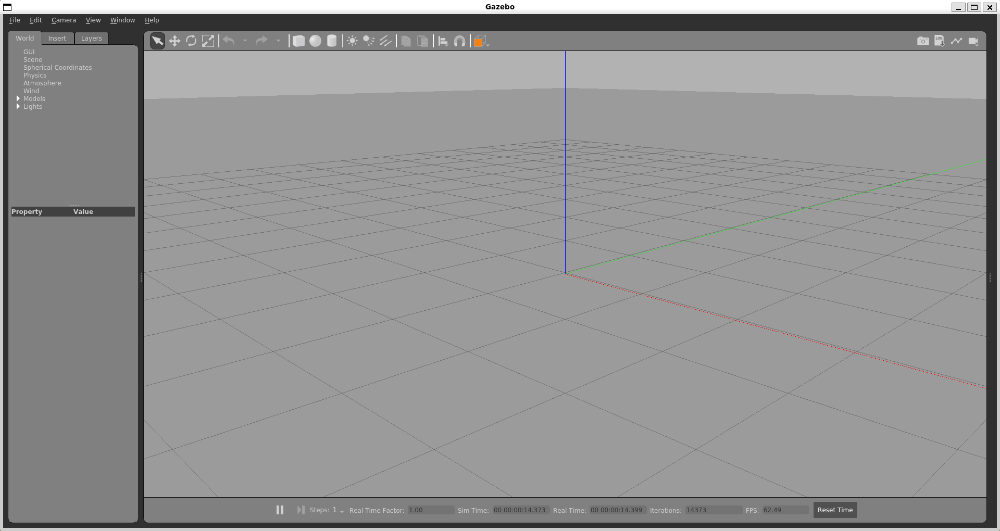

# WSL - Gazebo & ROS

> source: https://classic.gazebosim.org/tutorials?tut=install_on_windows#GazeboonWindowsviaWSL(WindowsSubsystemforLinux)

[**WSL**](https://docs.microsoft.com/en-us/windows/wsl/install) is a compatibility layer for running Linux binary executables on Windows 10 and newer.

The [**Project DAVE**](https://github.com/Field-Robotics-Lab/dave/wiki) provides [detailed instructions](https://github.com/Field-Robotics-Lab/dave/wiki/Install-on-Windows-using-WSL2) to setup WSL and install Gazebo together with ROS Noetic using Ubuntu Linux installed on Windows. ROS installation can be avoided and just follow instructions until the point of installing ROS Noetic packages and use apt to install libgazebo11-dev.

## List of contents:

### [WSL Configuration](#wsl-configuration)

- [Enable WSL](#enable-wsl)
- [Set WSL 2 as a default version](#set-wsl-2-as-a-default-version)
- [Distro install](#distro-install)
- [Distro pre-configure](#distro-pre-configure)

### [Install ROS and Gazebo](#install-ros-and-gazebo)

- [Install required tools](#install-required-tools)
- [Install ROS Noetic](#install-ros-noetic)
- [Install other ROS Dependencies](#install-other-ros-dependencies)

### [Graphics driver for WSL](#graphics-driver-for-wsl)

- [GPU Drivers](#gpu-drivers)
- [Multibeam sonar CUDA Library](#multibeam-sonar-cuda-library)
- [OpenGL check](#opengl-check)

### [Gazebo](#gazebo)

- [Verify setup](#verify-setup)
- [Run](#run)

---

## WSL Configuration

> source: https://docs.microsoft.com/en-us/windows/wsl/install-win10

Recommend using [Windows Terminal](https://www.microsoft.com/ko-kr/p/windows-terminal/9n0dx20hk701?rtc=1) to access Ubuntu in WSL2.

### Case: WSL2 is installed

If you **already have WSL installed**, all you need to do is run:

```powershell
wsl --update
```

and you’ll be **set to use GUI apps**.

### Enable WSL

Open the Powershell as administrator and run the following commands to:

- enable WSL:

```powershell
dism.exe /online /enable-feature /featurename:Microsoft-Windows-Subsystem-Linux /all /norestart
```

- and required features:

```powershell
dism.exe /online /enable-feature /featurename:VirtualMachinePlatform /all /norestart
```

**Reboot the system**.

### Set WSL 2 as a default version

After reboot, open the Powershell again and run:

```powershell
wsl --set-default-version 2
```

You can check the version with:

```powershell
wsl --version
```

### Distro install

You can list online available distro with:

```powershell
wsl --list --online
```

> The most reccomended Linux distribution for Gazebo and ROS is **Ubuntu-20.04**.

To install chosen distro (_ubuntu-20.04_ below) run:

```powershell
wsl --install ubuntu-20.04
```

Then you would have to configure the user credentials for new wsl distro. When prompted type the username and password.

You can run the newly installed distribution:

```powershell
wsl -d ubuntu-20.04
```

You also may set the default wsl distro, so after you type `wsl` in PS this distribution will run. To set up the default distro for wsl run:

```powershell
wsl --set-default ubuntu-20.04
```

### Distro pre-configure

Run system upgrade right after the subsystem is set.

```bash
sudo apt update && sudo apt full-upgrade --auto-remove -y
```

## Install ROS and Gazebo

> source: https://github.com/Field-Robotics-Lab/dave/wiki/Install-Directly-on-Host-%28Noetic%29

### Install required tools

```bash
sudo apt install -y build-essential cppcheck curl cmake lsb-release git python3-dbg python3-pip python3-venv ruby software-properties-common wget libeigen3-dev pkg-config protobuf-compiler qtbase5-dev libgles2-mesa-dev
```

### Install ROS Noetic

Install sources list:

```bash
sudo sh -c 'echo "deb http://packages.ros.org/ros/ubuntu $(lsb_release -sc) main" > /etc/apt/sources.list.d/ros-latest.list'
```

Install keys:

```bash
sudo apt-key adv --keyserver 'hkp://keyserver.ubuntu.com:80' --recv-key C1CF6E31E6BADE8868B172B4F42ED6FBAB17C654 && sudo apt update
```

Install **ROS Noetic**:

```bash
sudo apt install ros-noetic-desktop-full && \
sudo apt install ros-noetic-velodyne-gazebo-plugins python3-rosdep
```

Initialize and update _rosdep_:

```bash
sudo rosdep init && \
rosdep update
```

Finally set up `.bashrc` for working with ROS Noetic:

```
echo "source /opt/ros/noetic/setup.bash" | tee -a ~/.bashrc
```

Now you need to **logout and reload the shell**.

### Install other ROS Dependencies

After shell reload install other dependencies:

```bash
DIST=noetic; \
sudo apt install ros-${DIST}-rqt-robot-plugins ros-${DIST}-effort-controllers ros-${DIST}-joy ros-${DIST}-teleop-twist-joy ros-${DIST}-teleop-twist-keyboard ros-${DIST}-teleop-tools ros-${DIST}-joy-teleop ros-${DIST}-key-teleop ros-${DIST}-geographic-info ros-${DIST}-move-base ros-${DIST}-robot-localization ros-${DIST}-robot-state-publisher ros-${DIST}-xacro ros-${DIST}-rqt ros-${DIST}-rqt-common-plugins ros-${DIST}-hector-gazebo-plugins
```

> Note that the manipulator arm requires the `ros-noetic-effort_controllers` and glider requires the `ros-noetic-hector-gazebo-plugins`.

## Graphics driver for WSL

### GPU Drivers

#### [**README**](https://github.com/microsoft/wslg) for WSL OpenGL Support.

- [**NVIDIA** GPU driver for WSL](https://developer.nvidia.com/cuda/wsl)

- [**Intel** GPU driver for WSL](https://downloadcenter.intel.com/download/30579/Intel-Graphics-Windows-DCH-Drivers)

- [**AMD** GPU driver for WSL](https://community.amd.com/t5/radeon-pro-graphics-blog/announcing-amd-support-for-gpu-accelerated-machine-learning/ba-p/414185)

### Multibeam sonar CUDA Library

Follow **[Nvidia guide](https://docs.nvidia.com/cuda/wsl-user-guide/index.html)** to install CUDA library inside WSL.

Try `nvcc` for installation verification. If not working, add these paths exports at `~/.bashrc`:

```bash
export PATH=/usr/local/cuda/bin${PATH:+:${PATH}}
export LD_LIBRARY_PATH=/usr/local/cuda/lib64${LD_LIBRARY_PATH:+:${LD_LIBRARY_PATH}}
```

### OpenGL check

If you see slow fps, it's possible that your GPU is not loaded in the WSL. Try run:

```bash
sudo apt install mesa-utils && \
glxinfo | grep OpenGL
```

If you don't see your GPU name at the output as below:

```terminal
OpenGL vendor string: Microsoft Corporation
OpenGL renderer string: D3D12 (NVIDIA GeForce GTX 1660 Ti)
OpenGL core profile version string: 3.3 (Core Profile) Mesa 21.0.3 - kisak-mesa PPA
```

, try this:

```bash
sudo add-apt-repository ppa:kisak/kisak-mesa && \
sudo apt-get update && sudo apt dist-upgrade
```

And again `glxinfo | grep OpenGL`. It should work.

> Reference: https://github.com/microsoft/wslg/issues/86

---

## Gazebo

> source: https://field-robotics-lab.github.io/dave.doc/contents/installation/Install-Directly-on-Host/

### Verify setup

Verify that a supported version of Gazebo is installed with:

```bash
gazebo --version
```

This should yield something like below:

```terminal
Gazebo multi-robot simulator, version 11.11.0
Copyright (C) 2012 Open Source Robotics Foundation.
Released under the Apache 2 License.
http://gazebosim.org
```

### Run

Run Gazebo to verify that it starts:

```bash
gazebo
```

If the GUI apps are enabled in WSL it should open the Gazebo application window like:


